# Zed Aura

<!--
Badge targets below assume this fork lives at github.com/your-username/zed-aura.
Once pushed to your own GitHub repo, replace `your-username/zed-aura` in the
CI/release/commit/stars badge URLs (and their link targets) with the real
owner/repo path.
-->

[](https://zed.dev)
[](./LICENSE-GPL)
[](https://github.com/your-username/zed-aura/releases)
[](https://www.rust-lang.org)
[](#-themes)

Zed Aura is a fork of [Zed](https://github.com/zed-industries/zed), the
high-performance multiplayer code editor from the creators of
[Atom](https://github.com/atom/atom) and
[Tree-sitter](https://github.com/tree-sitter/tree-sitter). It adds editor
wallpapers (including animated GIF wallpapers), window transparency, and a
theme browser UI, on top of a curated pack of 113 themes — all built
directly into GPUI, the editor's own GPU-backed rendering pipeline, rather
than layered on top as a plugin. Wallpaper decoding is cache-evicted on
theme switch so idle memory use doesn't grow the longer a session runs.

## Table of contents

- [▪ Screenshots](#-screenshots)
  - [Animated wallpapers](#animated-wallpapers)
  - [Video](#video)
- [▪ What's added on top of upstream Zed](#-whats-added-on-top-of-upstream-zed)
- [▪ Themes](#-themes)
- [▪ Attribution and licensing](#-attribution-and-licensing)
- [▪ Installation](#-installation)
  - [Developing](#developing)
  - [Contributing](#contributing)
  - [Upstream Zed](#upstream-zed)

<a id="-screenshots"></a>

## ▪ Screenshots

<table align="center">
<tr>
<td align="center" width="50%">
  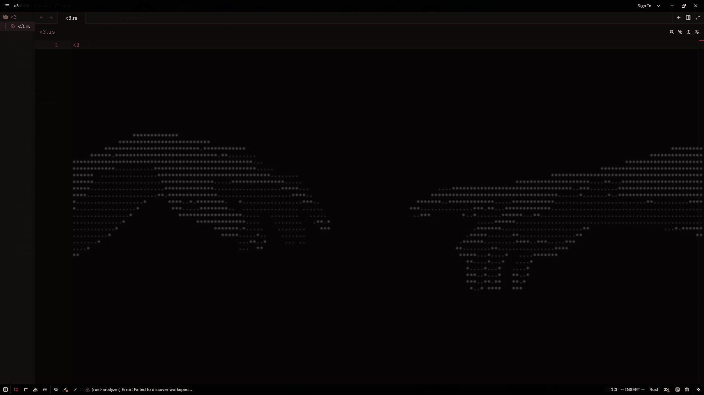<br />
  <sub><strong>Torii Dark</strong></sub>
</td>
<td align="center" width="50%">
  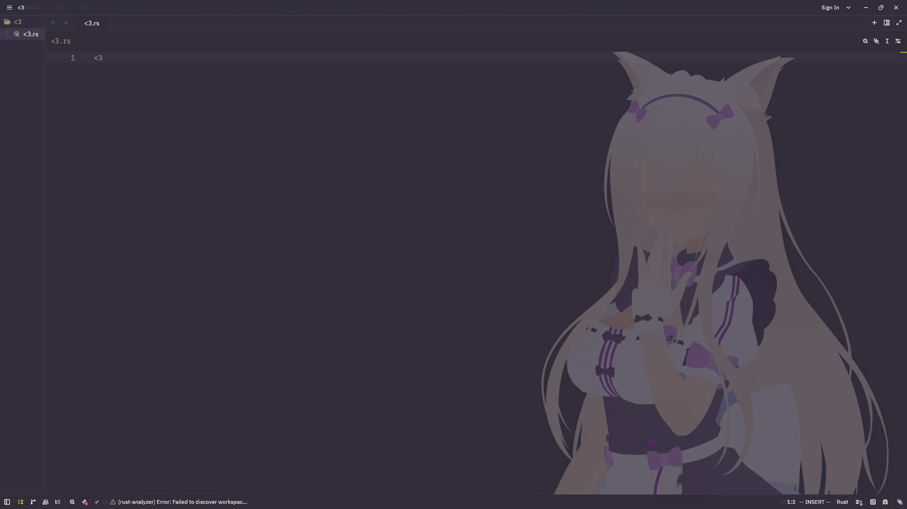<br />
  <sub><strong>Coconut</strong></sub>
</td>
</tr>
<tr>
<td align="center">
  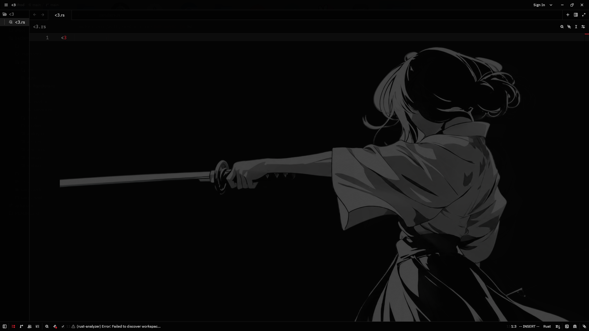<br />
  <sub><strong>Kill Dark</strong></sub>
</td>
<td align="center">
  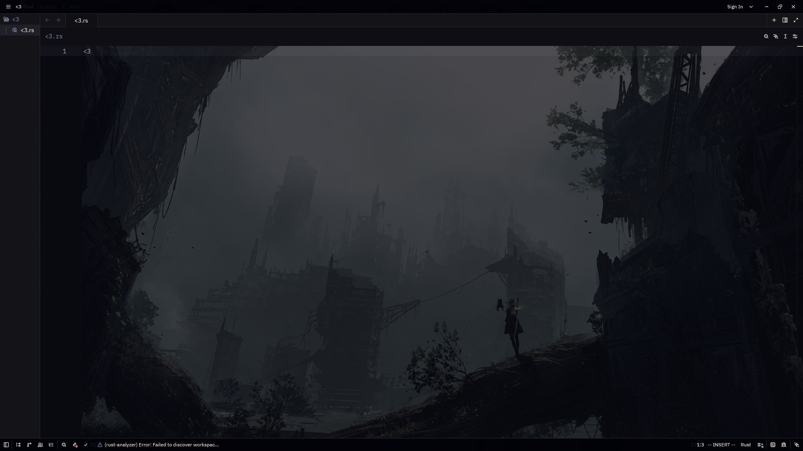<br />
  <sub><strong>Nier Ruins Dark</strong></sub>
</td>
</tr>
<tr>
<td align="center">
  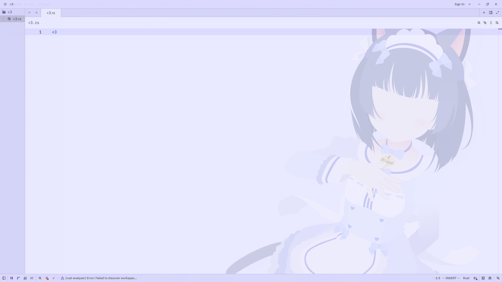<br />
  <sub><strong>Shigure</strong></sub>
</td>
<td align="center">
  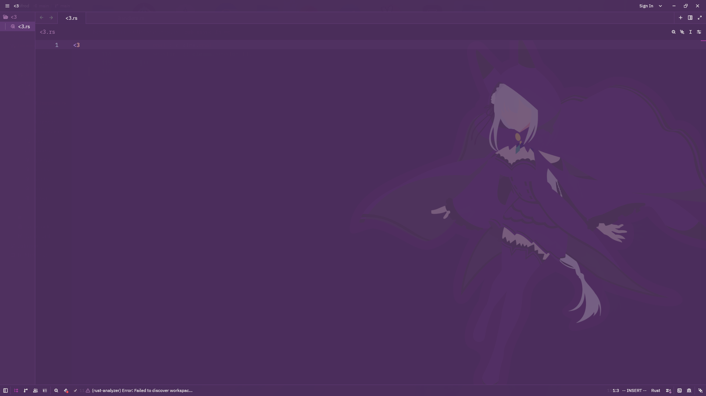<br />
  <sub><strong>Satsuki Dark</strong></sub>
</td>
</tr>
<tr>
<td align="center">
  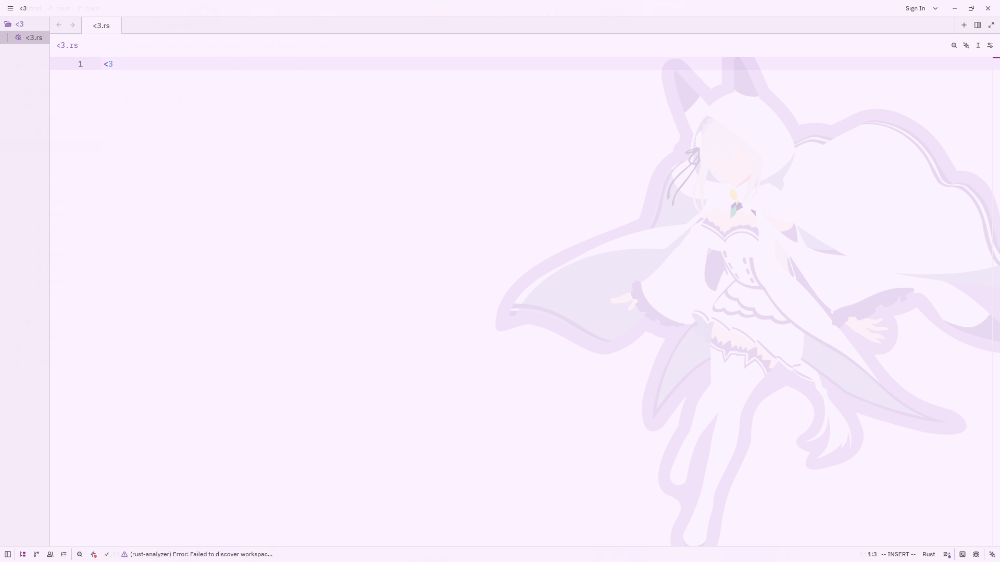<br />
  <sub><strong>Zero Two Light Lily</strong></sub>
</td>
<td align="center">
  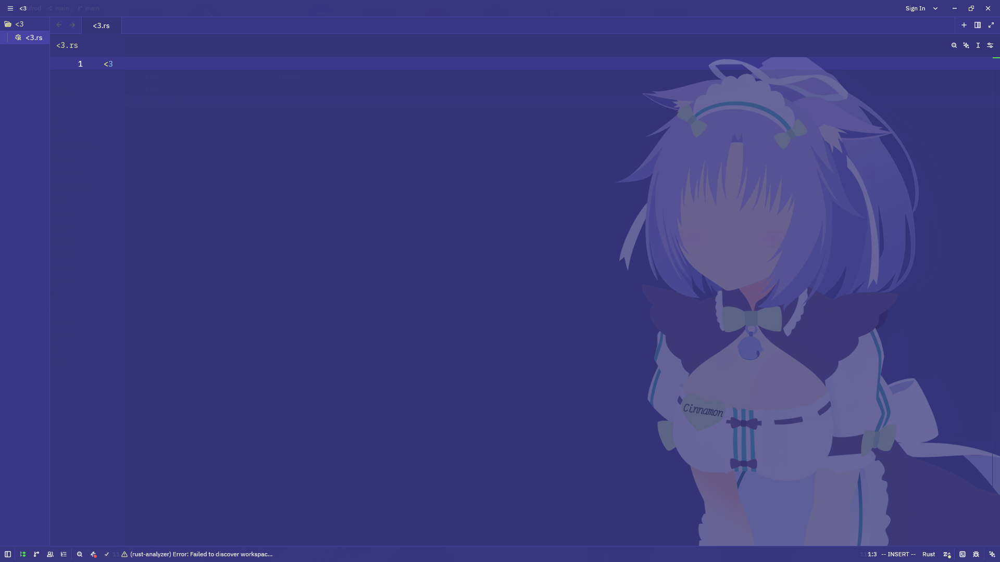<br />
  <sub><strong>Cinnamon</strong></sub>
</td>
</tr>
<tr>
<td align="center">
  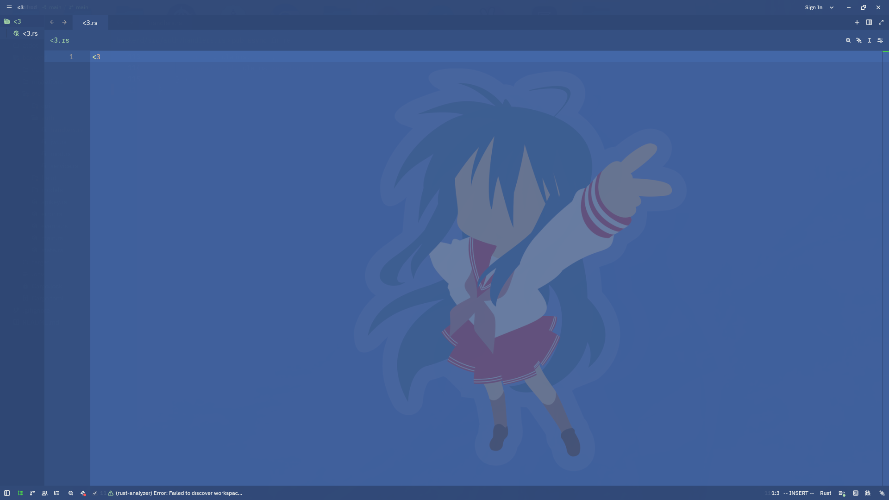<br />
  <sub><strong>Konata</strong></sub>
</td>
<td align="center">
  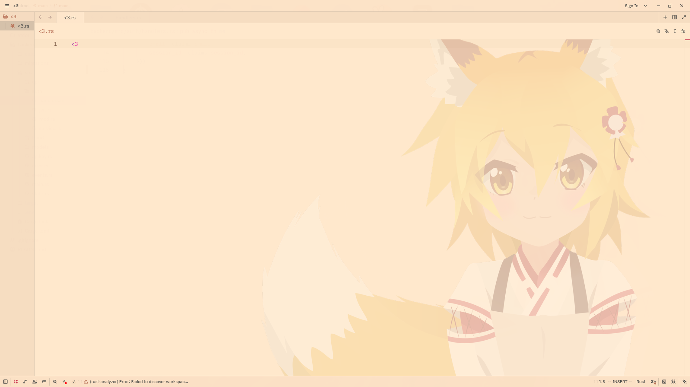<br />
  <sub><strong>Senko</strong></sub>
</td>
</tr>
</table>

<a id="animated-wallpapers"></a>

### Animated wallpapers

<table align="center">
<tr>
<td align="center" width="50%">
  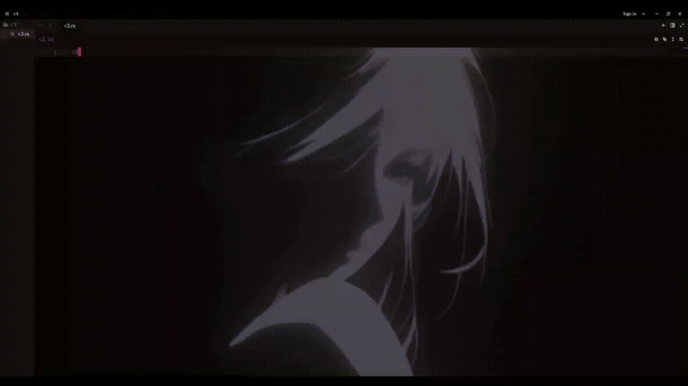<br />
  <sub><strong>Silhouette Dark</strong></sub>
</td>
<td align="center" width="50%">
  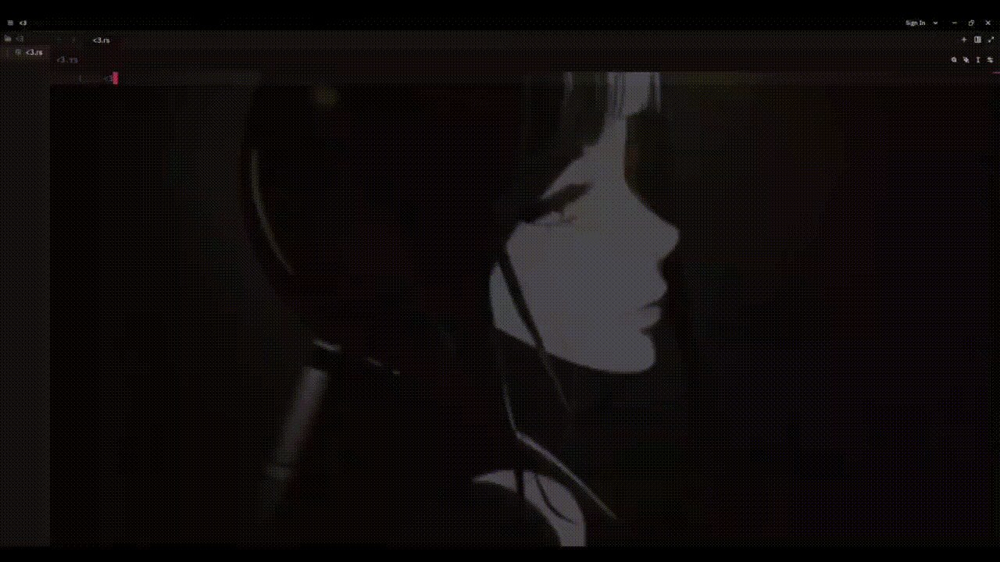<br />
  <sub><strong>Eclipse Dark</strong></sub>
</td>
</tr>
<tr>
<td align="center">
  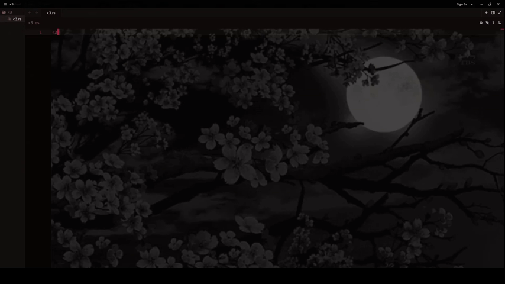<br />
  <sub><strong>Moonlight Dark</strong></sub>
</td>
<td align="center">
  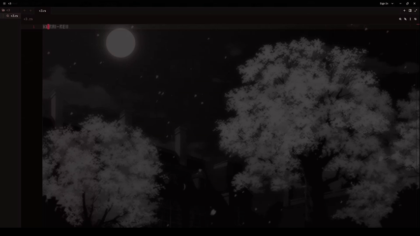<br />
  <sub><strong>Sasu Dark</strong></sub>
</td>
</tr>
</table>

<a id="video"></a>

### Video

https://github.com/user-attachments/assets/REPLACE_ME_WITH_UPLOADED_VIDEO_ID

<!--
GitHub does not render local repo video files inline. To embed the demo
video, drag-and-drop `docs/.readme-media/<3.mp4` into a GitHub PR/issue
comment box (or the README edit box on github.com) and it will be uploaded
to GitHub's asset CDN; then replace the placeholder link above with the
`https://github.com/user-attachments/assets/...` URL GitHub gives back.
-->

<a id="-whats-added-on-top-of-upstream-zed"></a>

## ▪ What's added on top of upstream Zed

### 1. Editor wallpapers

Any theme can carry a background image that is drawn behind the editor text
at partial opacity. Theme fields (set in the theme's JSON file):

| Field | Description |
|---|---|
| `wallpaper` | Path to the PNG/JPG drawn behind the editor |
| `wallpaper_scale` | Image scale (0.0–1.0) relative to the editor size |
| `wallpaper_offset_x` / `wallpaper_offset_y` | Pixel offset of the image |
| `wallpaper_anchor` | Which corner of the editor the image is anchored to |
| `wallpaper_opacity` | Opacity (defaults to 0.25) |

Engine files touched: `crates/theme/src/theme.rs`,
`crates/theme_settings/src/schema.rs` and `settings.rs`,
`crates/editor/src/editor.rs`, `crates/editor/src/element.rs` (the wallpaper
is drawn during the paint phase, not prepaint — GPUI panics otherwise).

GPUI splits a frame into two passes: prepaint computes layout only, and paint
is where assets are actually resolved and rasterized. `window.use_asset` does
more than fetch a decoded image — it also registers the redraw callback that
fires once an asynchronously-loading image finishes decoding. Calling it in
prepaint and caching the result on `EditorLayout` breaks that contract: the
image can still be mid-decode by the time paint runs, so `frame_count()` and
the `frame_index` computed from it can disagree with what `paint_image()`
sees a moment later, which panics on an out-of-bounds frame index. Doing the
`use_asset` call, the `frame_count() > 0` check, and `paint_image()` all
inside `paint_background()` keeps the check and the draw atomic, in the same
phase, with no window for the asset to change underneath them.

Wallpapers are decoded and painted through GPUI's own asset/image pipeline
(`window.use_asset::<ImgResourceLoader>`, `window.paint_image`) rather than a
custom image loader, so they get the same GPU-backed rendering path as any
other image element. Animated GIF wallpapers are supported: the frame to
paint is picked from the GIF's own per-frame delay timing (wall-clock time
modulo the loop's total delay), and `window.request_animation_frame()` is
only requested when the wallpaper actually has more than one frame — a
static PNG/JPG wallpaper costs nothing extra per frame.

To avoid pinning memory, only the wallpaper of the *currently active* theme
stays decoded — `evict_stale_wallpaper_asset` in `element.rs` evicts the
previous theme's image from GPUI's asset cache as soon as the theme changes,
including switching to a theme with no wallpaper at all. Without this, every
wallpaper ever viewed in a session (including large multi-frame GIFs) would
stay decoded in memory indefinitely.

#### Memory footprint

Wallpapers are decoded into a raw RGBA buffer, not kept as compressed
PNG/GIF bytes, so cost scales with pixel dimensions rather than file size. A
1920×1080 image costs roughly `1920 * 1080 * 4 bytes ≈ 8 MB` resident while
its theme is active; larger source images cost proportionally more. Because
only the active theme's wallpaper is kept decoded (see above), a session
never holds more than one static wallpaper's worth of memory at a time no
matter how many themes were previewed. Animated GIF wallpapers are the
exception: all frames are decoded and held simultaneously to drive the
per-frame delay timing, so a multi-frame animated wallpaper costs roughly
`frame_count` times the single-frame figure above for as long as that theme
is active.

### 2. Window transparency

`window_opacity` (a top-level setting, independent of the active theme)
blends the window's background surfaces — editor, panels, tabs, status
bar — toward transparent, and switches the window's background appearance to
`Blurred` so the compositor can blur what's behind it. See
`crates/settings_content/src/theme.rs` (`window_opacity` field) and
`crates/theme_settings/src/settings.rs` (`apply_window_opacity`).

```jsonc
// settings.json
"window_opacity": 0.85
```

### 3. Theme Browser

A **Themes → Browse Themes** menu entry (action `OpenThemeBrowser`) and a
Settings UI page that group themes by wallpaper with visual previews,
instead of scrolling a flat list of a hundred theme names.
Code: `crates/settings_ui/src/pages/theme_browser.rs`,
`crates/settings_ui/src/page_data.rs`, `pages.rs`, `settings_ui.rs`.

<a id="-themes"></a>

## ▪ Themes

Themes themselves are **not bundled in this repository** — Zed loads user
themes from `~/.config/zed/themes/`. This fork was developed against
`~/.config/zed/themes/doki-theme.json`, a set of **113 themes** built on top
of [doki-theme](https://github.com/doki-theme/doki-theme):

- **90 dark** themes, **23 light** themes.
- Every theme carries a wallpaper; **4** of them are animated (GIF)
  wallpapers rather than static images.
- Most theme colors come from **doki-theme-vim**.
- Most wallpaper images come from **doki-theme-assets**, plus a few added
  for this fork (shipped in
  `assets/images/backgrounds/doki/` in this repository).
- A handful of themes were hand-assembled for this fork rather than taken
  from upstream doki-theme.

### Using a theme

```jsonc
// settings.json
"theme": {
  "dark": "Monika Dark",
  "light": "NierAutomata Light"
}
```

Or use `cmd-k cmd-t` (`ctrl-k ctrl-t` on Linux/Windows) to open the theme
selector, or **Themes → Browse Themes** for the visual browser.

<a id="-attribution-and-licensing"></a>

## ▪ Attribution and licensing

- **Zed** — this fork is based on
  [zed-industries/zed](https://github.com/zed-industries/zed). Zed's source
  is licensed primarily under **GPL-3.0-or-later**, with some components
  under **Apache-2.0** (see `LICENSE-GPL` and `LICENSE-APACHE` at the repo
  root). All changes in this fork inherit the same terms.
- **doki-theme** — theme colors and a portion of the wallpaper images come
  from [doki-theme](https://github.com/doki-theme/doki-theme) (including the
  `doki-theme-vim` and `doki-theme-assets` subprojects), © 2020 Alex Simons,
  licensed under the **MIT License**. The original license and copyright
  notice are preserved alongside the upstream project.

<a id="-installation"></a>

## ▪ Installation

This is a source fork and is not published as a standalone distribution.
Build it from source following the instructions below.

<a id="developing"></a>

### Developing

- [Building Zed for macOS](./docs/src/development/macos.md)
- [Building Zed for Linux](./docs/src/development/linux.md)
- [Building Zed for Windows](./docs/src/development/windows.md)

<a id="contributing"></a>

### Contributing

This is a personal fork of Zed rather than a contribution target for
upstream Zed itself. For contributing to upstream Zed, see
[CONTRIBUTING.md](./CONTRIBUTING.md).

<a id="upstream-zed"></a>

### Upstream Zed

Zed is developed by **Zed Industries, Inc.** Learn more, download official
builds, or sponsor the upstream project at [zed.dev](https://zed.dev).

License information for third-party dependencies must be correctly provided
for CI to pass. This fork uses
[`cargo-about`](https://github.com/EmbarkStudios/cargo-about) to comply with
open source licenses, same as upstream Zed.
